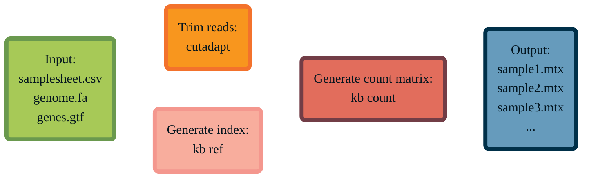

# scrnaseq_flow
> A pipeline for single-cell RNA-seq data, implemented in Nextflow for reproducibility and modularity. Supports trimming in cutadapt and alignment with kallisto-bustools.

[](https://www.docker.com/)
[](https://docs.conda.io/en/latest/)
[](https://sylabs.io/docs/)
[](https://www.nextflow.io/)

`scrnaseq_flow` takes in a comma-separated samplesheet of FASTQ data, as well as a genomic FASTA and GTF file. It then produces an index, trims, and pseudoaligns your reads automatically — all with full user customizability.


## 🔧 Usage 
`scrnaseq_flow` supports Nextflow's pipeline sharing functionality, meaning installation and execution is as simple as:
```
nextflow run jnwangg/scrnaseq_flow
```
For most use cases, the pipeline expects the following parameters:
``` bash
nextflow run jnwangg/scrnaseq_flow \
  --input samplesheet.csv \
  --outdir <path/to/output> \
  --genome GrCh37.fasta \
  --gtf GrCh37.gtf \
  --protocol 10XV3 \
  --profile docker \
```
To see detailed usage instructions, just add `--help true`.
```
Typical pipeline command:

  nextflow run main.nf --input samplesheet.csv --outdir /work/results --genome GrCh37.fasta --gtf GrCh37.gtf

Input/output options
  --input            [string]  Path to comma-separated file containing information about the samples to be processed.
  --outdir           [string]  The output directory where results will be saved.

Reference genome options
  --genome           [string]  Path to genomic FASTA file.
  --gtf              [string]  Path to reference GTF file.

Trimming options
  --skip_trim        [boolean] Boolean whether to skip trimming.
  --cutadapt_args    [string]  Additional arguments for cutadapt.

Indexing options
  --save_ref         [boolean] Boolean whether to save the reference produced by kb ref in the output directory.
  --kb_ref_args      [string]  Additional arguments for kb ref.

Alignment options
  --protocol         [string]  The protocol that was used to generate the single cell data, e.g. 10XV3 (default). [default: 10XV3]
  --kb_count_args    [string]  Additional arguments for kb count.

Max job request options
  --max_cpus         [integer] Maximum number of CPUs that can be requested for any single job. [default: 16]
  --max_memory       [string]  Maximum amount of memory that can be requested for any single job. [default: 128.GB]
  --max_time         [string]  Maximum amount of time that can be requested for any single job. [default: 240.h]
```


  
## 📖 Examples
