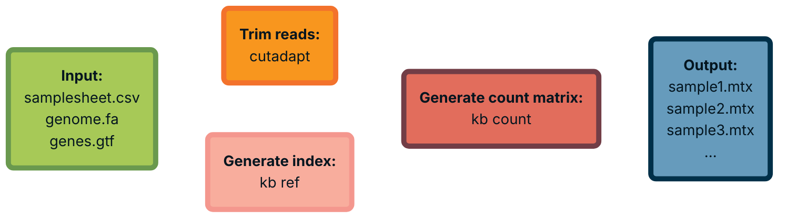

# scrnaseq_flow
> A pipeline for single-cell RNA-seq data, implemented in Nextflow for reproducibility and modularity. Supports trimming in cutadapt and alignment with kallisto-bustools.

[](https://www.docker.com/)
[](https://docs.conda.io/en/latest/)
[](https://sylabs.io/docs/)
[](https://www.nextflow.io/)

`scrnaseq_flow` takes in a comma-separated samplesheet of FASTQs, as well as a genomic FASTA and GTF file. It then produces an index, trims, and pseudoaligns your reads automatically — all with full user customizability.


## 🔧 Usage 
> [!TIP]
> `scrnaseq_flow` allows you to customize pipline execution via a variety of optional arguments. These include the ability to specify additional arguments for cutadapt and kallisto-bustools, via `--cutadapt_args`, `--kb_ref_args`, and `--kb_count_args`. Run the pipeline with `--help true` to see a full list of arguments.

`scrnaseq_flow` supports Nextflow's pipeline sharing functionality, meaning installation and execution is as simple as:
```
nextflow run jnwangg/scrnaseq_flow
```
For most use cases, the pipeline expects the following parameters:
``` bash
nextflow run jnwangg/scrnaseq_flow \
  --input    <path/to/samplesheet.csv> \
  --outdir   <path/to/output> \
  --genome   <path/to/genome.fa> \
  --gtf      <path/to/genes.gtf> \
  --protocol 10XV3 \
  --profile  docker \
```
To see detailed usage instructions, run the pipeline with `--help true`.

## 📝 Samplesheets
> [!NOTE]
> Samplesheets may contain data that is single-end, paired-end, or a mix of both! The pipeline automatically detects whether a second read is provided, and will adjust trimming and alignment appropriately.

Before running `scrnaseq_flow`, prepare a samplesheet with your input data. All samplesheets must have four named columns:
| Column | Description |
| ------------- | ------------- |
| `sample`  | **Required**. Custom sample name. Be descriptive, as output will be labelled using this name. |
| `read_1`  | **Required**. Absolute path to a first FASTQ. |
| `read_2`  | **Optional**. Absolute path to a second FASTQ, if the sample is paired-end. |
| `whitelist`  | **Optional**. Whitelist of cell barcodes for the sample. May be required for certain protocols. |

A valid samplesheet should look something like the following:
```
sample,read_1,read_2,whitelist
TR_ID1,SRR12345_S1_L001_R1.fastq.gz,SRR12345_S1_L001_R2.fastq.gz,TR_ID1_whitelist.txt
TR_ID2,SRR12345_S2_L001_R1.fastq.gz,SRR12345_S2_L001_R2.fastq.gz,TR_ID2_whitelist.txt
TR_ID3,SRR12345_S3_L001_R1.fastq.gz,SRR12345_S3_L001_R2.fastq.gz,TR_ID3_whitelist.txt
CTRL_ID1,SRR12345_S4_L002_R1.fastq.gz,,
CTRL_ID2,SRR12345_S5_L002_R1.fastq.gz,,
```

## ⚙️ Configuration
> [!WARNING]
> When specifying paths to FASTQs, samplesheets, or other files while using Docker/Singularity, it may be necessary to explicitly mount their directories for the pipeline to successfully locate them. For Singularity, use `singularity.runOptions` to specify these directories. For Docker, use `docker.runOptions`.

Configuration of `scrnaseq_flow` for your compute environment is highly encouraged. Nextflow supports three primary methods for customization:
- Custom parameter files: `-params-file <file.yaml>`
- Custom configuration files: `-c <file.config>`
- Pipeline profiles: `-profile <name>`

***Parameter files*** are useful when you want to specify many arguments, which can be tedious to type out on the command line. A parameter file `params.yaml` may look like:
```yaml
input: '/home/data/samplesheet.csv'
outdir: '/work/data/results/'
genome: '/home/data/GRCh37.fa'
cutadapt_args: '--poly-a -m 20 --max-n 0.10'
<...>
```
***Configuration files*** are how you modify pipeline settings. These may be the compute resources used by each process (memory, CPUs), pipeline executors (SLURM, AWS), custom containers, or any other desired changes. A configuration file `local.config` may look like:
```nextflow
process.executor = 'awsbatch'
process {
  withName: CUTADAPT {
    cpus = 8
    memory = 24.GB
    time = 3.h
  }
}
```
The above file tells the pipeline to execute via AWS Batch, and customizes the resources used by all cutadapt proceses. For more information on writing Nextflow configuration files, see the extensive documentation provided [here](https://www.nextflow.io/docs/latest/index.html).  

***Profiles*** are handy configuration presets that are premade for various compute environments. Four generic profiles are bundled with `scrnaseq_flow`:
| Profile | Description |
| ------------- | ------------- |
| `singularity`  | Runs all pipeline processes in Singularity containers. |
| `docker`  | Runs all pipeline processes in Docker containers. |
| `conda`  | Runs all pipeline processes via Conda. |
| `hpc`  | Runs all pipeline processes in Singularity containers, with SLURM job management. |

> [!IMPORTANT]
> It is highly recommended that Singularity or Docker be used for optimal pipeline reproducibility. Conda is supported, but is not guaranteed to reproduce an environment exactly.

If a profile is not specified, `scrnaseq_flow` will run locally. The pipeline also supports configuration profiles from [nf-core's configuration repository](https://github.com/nf-core/configs), which have been submitted for use by various institutional HPC clusters.

## 📖 Output
A typical run of `scrnaseq_flow` will produce the following directory structure in the output directory: 
```
outdir/
├── kallisto/
│   ├── count/
│   │   ├── sampleA.count/
│   │   │   ├── counts_unfiltered/
│   │   │   │   └── cells_x_genes.mtx
│   │   │   └── ...
│   │   ├── sampleB.count/
│   │   │   ├── counts_unfiltered/
│   │   │   │   └── cells_x_genes.mtx
│   │   │   └── ...
│   │   └── ...
│   └── ref/
│       ├── genome.idx
│       ├── t2g.txt
│       └── cdna.fa
└── cutadapt/
    ├── logs/
    │   ├── sampleA.cutadapt.log
    │   ├── sampleB.cutadapt.log
    │   └── ...
    ├── sampleA_R1.trimmed.fastq.gz
    ├── sampleA_R2.trimmed.fastq.gz
    ├── sampleB_R1.trimmed.fastq.gz
    └── ...
```


